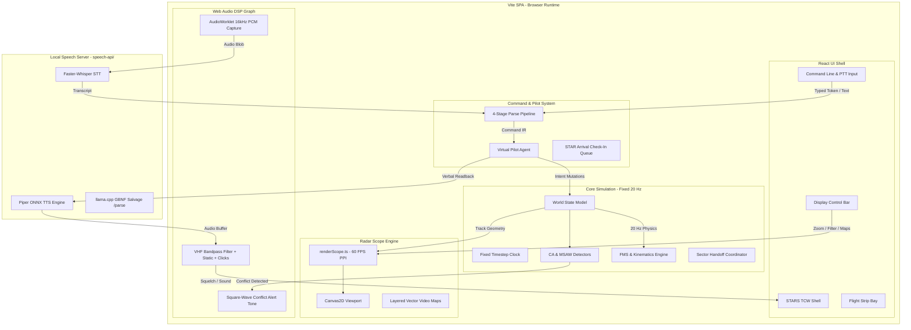

# ATC-SIM

[](https://www.typescriptlang.org/)
[](https://vitejs.dev/)
[](https://reactjs.org/)
[](https://vitest.dev/)
[](https://fastapi.tiangolo.com/)

An in-browser, high-fidelity **STARS-like (Standard Terminal Automation Replacement System)** radar air traffic control simulator and training workstation. It replicates terminal radar (TRACON) operations with 60 FPS Canvas2D PPI rendering, typed and spoken ATC command parsing (FAA JO 7110.65 phraseology), realistic flight kinematics and FMS procedural navigation, simulated pilot voice readbacks with VHF radio acoustic DSP, and real-time safety alerting (Conflict Alert & MSAW).

> [!IMPORTANT]
> **DISCLAIMER**: This simulator is built for **training and entertainment purposes only**. It is not certified for National Airspace System (NAS) operational use, is not FAA equipment, and is not affiliated with the Federal Aviation Administration or Raytheon Technologies. The user interface is a STARS-like visual and functional analog. See [`docs/DISCLAIMER.md`](docs/DISCLAIMER.md) and [`docs/PRODUCT.md`](docs/PRODUCT.md) for details.

---

## Table of Contents

- [Quick Start](#quick-start)
  - [Prerequisites](#prerequisites)
  - [Installation & Dev Server](#installation--dev-server)
  - [URL Query Parameters](#url-query-parameters)
- [Environment Configuration](#environment-configuration)
- [Voice & Local Speech Subsystem (`speech-api`)](#voice--local-speech-subsystem-speech-api)
  - [Zero-Cloud Architecture](#zero-cloud-architecture)
  - [Setting Up the Local Speech Server](#setting-up-the-local-speech-server)
  - [Endpoints](#endpoints)
- [Features & Capabilities](#features--capabilities)
  - [STARS TCW Display Emulation](#stars-tcw-display-emulation)
  - [Flight Kinematics & FMS Navigation](#flight-kinematics--fms-navigation)
  - [Safety Alerting (CA & MSAW)](#safety-alerting-ca--msaw)
  - [Simulated Pilot Agent & Handoffs](#simulated-pilot-agent--handoffs)
- [ATC Command Reference](#atc-command-reference)
  - [Typed Command Syntax](#typed-command-syntax)
  - [Spoken Phraseology (FAA JO 7110.65)](#spoken-phraseology-faa-jo-711065)
- [Controls & Keybindings](#controls--keybindings)
  - [Scope Controls & Mouse Interaction](#scope-controls--mouse-interaction)
  - [Scope Keypad Shortcuts](#scope-keypad-shortcuts)
- [System Architecture](#system-architecture)
  - [Overview](#overview)
  - [Multi-Stage Parse Pipeline](#multi-stage-parse-pipeline)
  - [Coordinate System](#coordinate-system)
- [Aeronautical Data & CIFP Importer](#aeronautical-data--cifp-importer)
- [Development & Testing](#development--testing)
- [Documentation Index](#documentation-index)
- [License](#license)

---

## Quick Start

### Prerequisites

- **Node.js**: `v20.0.0+`
- **npm**: `v10.0.0+`
- **Python**: `3.11+` *(Optional, required only for local speech recognition/synthesis and Path C salvage parsing)*

### Installation & Dev Server

```bash
# Clone and install dependencies
git clone https://github.com/benmaxlevy/ATC-SIM.git
cd ATC-SIM
npm install

# Start the Vite development server
npm run dev
```

Open your browser to `http://localhost:5173`.

### URL Query Parameters

Customize simulation scenarios, traffic volume, random seeding, and debug overlays directly via URL search parameters:

| Parameter | Type / Example | Description |
|---|---|---|
| `traffic` | `?traffic=30` | Number of initial arrival aircraft to spawn (e.g. `30` for a high-density stress test). |
| `seed` | `?seed=42` | PRNG seed for deterministic arrival generation and slot entry times (default: `1`). |
| `scenario` | `?scenario=kdem-ils27` | Airspace scenario to load (default: KDEM TRACON Runway 27). |
| `debug` | `?debug=fps` | Displays real-time performance HUD showing canvas FPS, track count, and tick duration. |
| `voice` | `?voice=http` \| `?voice=web` \| `?voice=null` | Force active speech backend (`http` local server, browser `web`, or headless `null`). |

Examples:
- `http://localhost:5173/?traffic=30&debug=fps` — 30-track stress test with real-time FPS counter.
- `http://localhost:5173/?seed=2` — Seeded arrival schedule with reshuffled STAR slots.

---

## Environment Configuration

Configuration templates are provided for both the frontend SPA and the local Python speech service.

### Frontend (`.env`)

Copy `.env.example` to `.env` in the root directory if you wish to override speech API endpoints:

```bash
cp .env.example .env
```

| Variable | Default | Description |
|---|---|---|
| `VITE_STT_URL` | `http://127.0.0.1:8090/stt` | Endpoint for speech-to-text audio transcription |
| `VITE_TTS_URL` | `http://127.0.0.1:8090/tts` | Endpoint for pilot readback audio synthesis |
| `VITE_SPEECH_TOKEN` | *(empty)* | Optional shared-secret header for local speech-api |

### Speech Service (`speech-api/.env`)

The local Python speech service is configured via `speech-api/.env` (copy from `speech-api/.env.example`).

```bash
cd speech-api
cp .env.example .env
```

It supports configuring custom STT/TTS model weights, preloaded voice rosters, CUDA offloading, and custom local `.gguf` models for Path C salvage parsing. For the full environment variable reference and configuration guide, see [`speech-api/README.md`](speech-api/README.md).

---

## Voice & Local Speech Subsystem (`speech-api`)

### Zero-Cloud Architecture

ATC-SIM enforces a strict **zero paid/metered API policy**. All speech-to-text, text-to-speech, and language salvage models run 100% locally on your machine via the bundled Python service in [`speech-api/`](speech-api/).

- **STT (Speech-to-Text)**: [Qwen3-ASR](https://huggingface.co/Qwen/Qwen3-ASR-1.7B) running locally through `qwen-asr`. Uses ATC callsign, fix, and procedure context to bias transcription.
- **TTS (Text-to-Speech)**: [Piper TTS](https://github.com/OHF-Voice/piper1-gpl) with ONNX Runtime using high-speed multi-speaker medium voices (`en_US-lessac-medium`), assigning distinct voices to different airline callsigns.
- **Path C Salvage Parser**: [llama-cpp-python](https://github.com/abetlen/llama-cpp-python) running quantized `MaziyarPanahi/Qwen3-4B-Instruct-2507-GGUF` with GBNF grammar-constrained decoding. Loads by default and operates solely as fallback salvage when deterministic parsers miss.

### Setting Up the Local Speech Server

1. Navigate to `speech-api` and create a virtual environment:
   ```bash
   cd speech-api
   python3 -m venv .venv
   source .venv/bin/activate   # On Windows: .venv\Scripts\activate
   ```
2. Install dependencies:
   ```bash
   pip install -r requirements.txt
   ```
3. Download open weights from Hugging Face:
   ```bash
   python download_weights.py
   ```
4. Start the speech API server:
   ```bash
   uvicorn app:app --host 127.0.0.1 --port 8090
   ```

### Endpoints

| Method | Path | Request Body | Response | Description |
|---|---|---|---|---|
| `GET` | `/health` | — | `{ "ok": true, "sttModel": "...", "ttsVoice": "...", "parse": "ready" }` | Health check & model status |
| `POST` | `/stt` | `audio/wav` (PCM 16kHz) | `{ "text": "...", "confidence": 0.95 }` | Transcribe controller speech |
| `POST` | `/tts` | `{ "text": "...", "voiceId": "..." }` | `audio/wav` binary stream | Synthesize pilot readback |
| `POST` | `/parse` | `{ "text": "...", "context": { ... } }` | Command IR JSON | Optional GBNF salvage parser |

---

## Features & Capabilities

### STARS TCW Display Emulation

- **Radar PPI & Camera**: North-up display with discrete range presets (5, 10, 15, 20, 30, 40, 50, 60 NM), camera panning/slewing, and single-click or airport recentering.
- **Datablocks**:
  - **Full Datablocks (FDB)**: 3-line layout showing Callsign/CID, Mode C reported altitude (hundreds of ft) & assigned altitude, ground speed (tens of kt), scratchpad, and climb/descent arrows.
  - **Limited Datablocks (LDB)**: Compact track display for unowned or filtered targets.
  - **Leader Lines (L1–L9)**: 9 compass keypad directions with 4 selectable lengths (0px, 24px, 36px, 48px).
- **Target History & Prediction**:
  - Discrete radar history dots (0–5 dots sampled at 5-second intervals).
  - Predicted Track Line (PTL): 1.0 to 4.0 minute forward ground track lookahead vector (`OWN` or `ALL`).
- **Target Proximity Alert (TPA)**: Selectable J-rings / separation halos (3 NM / 5 NM) for spacing management.
- **Display Control Bar (DCB)**: Authentic green physical button matrix with MAIN and AUX menu switching, interactive wheel spinners (RANGE, RR, LDR DIR, LDR LEN, BRITE, CHAR SIZE), altitude filters, and persistent local PREF slots stored in `localStorage`.
- **System Status Area (SSA)**: Real-time top-left status display showing UTC/Sim time, altimeter setting (29.92), active altitude filter limits, and sensor mode.

### Flight Kinematics & FMS Navigation

- **Kinematic Realism**: Fixed 3°/s standard rate turns with bank transitions, standard climb/descent rate profiles (1,500–2,500 fpm), and acceleration limits.
- **Lateral FMS**: Direct-to navigation (`DCT <FIX>`), fly-by waypoint sequencing, and STAR route transitions.
- **Vertical Constraints**: `DESCEND_VIA` and `CLIMB_VIA` procedures with step-down crossing restriction compliance (`CROSS <FIX> <ALTITUDE> [AT|AT_OR_ABOVE|AT_OR_BELOW]`).
- **Instrument Approaches**: ILS localizer interception geometry with arming/capture modes, 3° glideslope descent tracking, and missed approach / go-around procedures (`GA`).

### Safety Alerting (CA & MSAW)

- **Conflict Alert (CA)**: Continuous evaluation of lateral (< 3.0 NM) and vertical (< 1,000 ft) aircraft separation. Triggers visual flashing in datablocks, red target highlighting, and continuous Web Audio square-wave warning beeps.
- **Minimum Safe Altitude Warning (MSAW)**: Polygon-based Minimum Vectoring Altitude (MVA) floor checks that alert when aircraft descend below safe sector altitudes.

### Simulated Pilot Agent & Handoffs

- **Callsign Resolution**: Matches callsigns via telephony name ("Delta 123"), ICAO code ("DAL123"), numeric tail ("123"), or currently hooked radar target.
- **Automated Check-Ins**: Staggered STAR arrival check-in radio calls as aircraft enter the TRACON sector.
- **Inbound Handoff Workflow**: Inbound arrivals spawn in pending handoff state from Center (unowned green FDB) → Controller clicks track or presses `F3` to accept → Track becomes owned (white FDB) → Radio frequency unlocked → Pilot checks in.
- **Realistic Readbacks**: Generates verbal readbacks following FAA JO 7110.65 digit grouping (e.g. "climb and maintain five thousand, Delta one twenty-three"), plus "unable" responses for invalid clearances.

---

## ATC Command Reference

Commands can be entered via the bottom command line prompt or spoken over Push-to-Talk (PTT).

### Typed Command Syntax

Prefix with callsign or click a radar target first:

| Category | Typed Syntax | Example | Description |
|---|---|---|---|
| **Heading** | `H <DEG>` | `DAL123 H 240` | Fly magnetic heading 240° |
| | `L <DEG>` / `R <DEG>` | `AAL456 L 090` | Turn left to heading 090° |
| | `T <DEG>L` / `T <DEG>R` | `SWA789 T 20L` | Turn 20 degrees left (relative) |
| | `PH` | `DAL123 PH` | Fly present heading |
| **Altitude** | `C <HUNDREDS>` | `DAL123 C 50` | Climb and maintain 5,000 ft |
| | `D <HUNDREDS>` | `DAL123 D 30` | Descend and maintain 3,000 ft |
| | `A <HUNDREDS>` | `DAL123 A 20` | Maintain 2,000 ft |
| **Speed** | `S <KNOTS>` | `DAL123 S 210` | Maintain 210 knots indicated airspeed |
| | `S <KNOTS>+` / `S <KNOTS>-` | `DAL123 S 180+` | Maintain 180 knots or greater / less |
| **Direct / Route** | `DCT <FIX>` | `DAL123 DCT BAF` | Proceed direct to fix/waypoint |
| | `VIA <STAR>` | `DAL123 VIA DEM1` | Descend via published STAR profile |
| | `JOIN <STAR>` | `DAL123 JOIN DEM1` | Join procedure at nearest leg |
| **Crossing** | `X <FIX> <ALT>` | `DAL123 X CAM 40` | Cross fix at 4,000 ft |
| | `X <FIX> <ALT>A` / `B` | `DAL123 X CAM 40A` | Cross fix at or above / at or below 4,000 ft |
| **Approach** | `APP ILS<RWY>` | `DAL123 APP ILS27` | Cleared ILS Runway 27 approach |
| | `IL ILS<RWY>` | `DAL123 IL ILS27` | Intercept localizer Runway 27 |
| | `EXP ILS<RWY>` | `DAL123 EXP ILS27` | Expect ILS Runway 27 approach |
| **Compound ILS**| `<H> <A> APP ILS<RWY>` | `DAL123 R240 A20 APP ILS27` | Turn right 240, maintain 2000 until established, cleared ILS 27 |
| **Transponder** | `SQ <CODE>` | `DAL123 SQ 4201` | Squawk transponder beacon code |
| | `I` / `ID` | `DAL123 I` | Squawk ident (flashes target symbol) |
| **Handoff** | `HO <SECTOR>` | `DAL123 HO TWR` | Initiate handoff to Tower / Center |
| | `F3` / `Enter` | `DAL123` + `F3` | Accept inbound handoff / track ownership |
| **Miscellaneous**| `GA` | `DAL123 GA` | Go around / execute missed approach |
| | `SH` / `SA` | `DAL123 SH` | Say heading / say altitude |

### Spoken Phraseology (FAA JO 7110.65)

| Clearance | Spoken Phrase Example |
|---|---|
| Vector | *"Delta one twenty-three, fly heading two four zero"* |
| Turn | *"American four fifty-six, turn left heading zero niner zero"* |
| Climb / Descend | *"Delta one twenty-three, descend and maintain three thousand"* |
| Speed | *"Southwest seven eighty-nine, reduce speed to two one zero knots"* |
| Direct | *"Delta one twenty-three, cleared direct Barnes"* |
| Descend Via | *"Delta one twenty-three, descend via the DEMO ONE arrival"* |
| Approach Clearance | *"Delta one twenty-three, turn right heading two four zero, maintain two thousand until established on the localizer, cleared ILS runway two seven approach"* |
| Go Around | *"Delta one twenty-three, go around, fly published missed approach"* |

---

## Controls & Keybindings

Press **`F1`** at any time in the app to open the interactive keyboard help overlay.

### Scope Controls & Mouse Interaction

| Action | Shortcut / Mouse |
|---|---|
| **Range In / Range Out** | `PageUp` / `PageDown` or `Mouse Wheel` (5, 10, 15, 20, 30, 40, 50, 60 NM) |
| **Pan / Slew Radar View** | `Right Click + Drag` or `Middle Click + Drag` |
| **Center View on Airport** | `Home` |
| **Center View on Click** | `End` or `Double-Click PPI` |
| **Select Track / Accept Handoff**| `Left Click` target symbol or datablock |
| **Deselect Track** | `Left Click` empty radar background |
| **Switch Focus (Command / PPI)** | `Tab` |

### Scope Keypad Shortcuts

| Key | Function |
|---|---|
| `L` then `1`–`9` | Set datablock leader line direction (Numpad compass positions) |
| `T` | Toggle Full Datablock (FDB) ↔ Limited Datablock (LDB) |
| `M` | Toggle Mode C altitude field |
| `F` | Set Altitude Filter band (`F` → min hundreds → `Enter` → max hundreds → `Enter`) |
| `H` | Toggle radar history trail dots (0 ↔ last count) |
| `F1` | Open keyboard help cheatsheet |
| `F3` / `F4` | Accept / drop track ownership |
| `F7` | Toggle Predicted Track Line (`PTL ALL`) |
| `F8` | Cycle radar history dot count |
| `/` | Immediately focus radio command line |
| `Shift + H` | Issue Tower handoff to aircraft established on final |

---

## System Architecture

### Overview



1. **Deterministic 20 Hz Simulation**: The physical simulation updates at a constant 20 Hz via an accumulator-based physics clock decoupled from rendering. Core logic is pure TypeScript with no DOM dependencies.
2. **60 FPS Canvas2D Scope Rendering**: The PPI radar scope is rendered via high-performance Canvas2D supporting dense traffic with history trails, leader lines, datablocks, J-rings, and vector maps.
3. **React TCW Shell Overlay**: Manages the surrounding workstation workspace: Display Control Bar (DCB), Flight Progress Strips, Command Line, System Status Area (SSA), and menus.

### Multi-Stage Parse Pipeline

Commands from keyboard input or transcribed speech are evaluated through a robust 4-stage pipeline:

```
User Input (Text or Spoken Audio)
  │
  ├──► [Stage 0: Normalization] (Telephony expansion, number word translation, whitespace cleanup)
  │
  ├──► [Stage 1: Typed Shorthand] (Fast STARS token parser: H240, C50, S210, APP ILS27)
  │      └─► Hit? ──► Return Command IR (parseStage: "typed")
  │
  ├──► [Stage 2: Path A - Spoken Grammar] (Deterministic FAA JO 7110.65 spoken English grammar)
  │      └─► Hit? ──► Return Command IR (parseStage: "spoken_a")
  │
  ├──► [Stage 3: Path B - Fuzzy Rewrite] (Spoken-to-typed phonetic and alias salvage)
  │      └─► Hit? ──► Return Command IR (parseStage: "spoken_b")
  │
  └──► [Stage 4: Path C - Local LLM Salvage] (Optional GBNF grammar-constrained llama.cpp /parse)
         └─► Hit? ──► Validate JSON against Command IR schema ──► Return (parseStage: "llm_c")
```

All parsed instructions resolve to strongly typed Command IR structures (`HeadingInstruction`, `AltitudeInstruction`, `SpeedInstruction`, `DirectInstruction`, `ApproachInstruction`, `CrossInstruction`, `HandoffInstruction`, etc.).

### Coordinate System

- **Plane**: Local East-North-Up (ENU) tangent plane in nautical miles (`NmEastNorth`: `xNm` East, `yNm` North) centered at the Airport Reference Point (ARP).
- **Headings**: True/Magnetic heading degrees `[0, 360)` where `000°` = North (+y world), `090°` = East (+x world).
- **Display Mapping**: North-up PPI maps +y (world North) to -y (canvas up). See [`docs/COORDINATE-SYSTEM.md`](docs/COORDINATE-SYSTEM.md).

---

## Aeronautical Data & CIFP Importer

ATC-SIM includes an automated tool to ingest FAA Coded Instrument Flight Procedures (CIFP) in ARINC 424 format into simulator JSON catalogs:

```bash
# Run CIFP procedure extraction tool
npm run cifp:import
```

Processed data defines:
- Airports, Runways, Displaced Thresholds, and Localizer/Glideslope geometry
- Waypoints, Navaids (VOR/DME, NDB), and Enroute Fixes
- SIDs (Standard Instrument Departures) and STARs (Standard Terminal Arrivals)
- Instrument Approach Plates (ILS, RNAV, Visual)

---

## Development & Testing

### Available Scripts

```bash
# Run Vitest unit & integration test suites
npm test

# Run Vitest in interactive watch mode
npm run test:watch

# Strict TypeScript type check
npm run typecheck

# ESLint check
npm run lint

# Prettier format check & auto-format
npm run format:check
npm run format

# Run full CI suite (typecheck + lint + format:check + tests)
npm run ci
```

### Testing Strategy

- **Core & Kinematics Tests**: Unit tests verifying fixed timestep integration, standard rate turn limits, altitude crossing restrictions, and localizer capture math.
- **Parser Test Suite**: Thousands of unit tests verifying JO 7110.65 spoken phrases, vice token variations, and rejection of malformed clearances.
- **Integration Tests**: Tests full radio command execution against simulation state in `tests/integration/`.
- **Python Tests**: Unit tests in `speech-api/tests/` verifying FastAPI endpoints, WAV encoding, and GBNF parsing.

---

## Documentation Index

- [`docs/COORDINATE-SYSTEM.md`](docs/COORDINATE-SYSTEM.md) — Tangent plane ENU coordinate math and projection formulas.
- [`docs/DISCLAIMER.md`](docs/DISCLAIMER.md) — Legal notice and non-FAA operational disclaimer.
- [`docs/PRODUCT.md`](docs/PRODUCT.md) — Product scope and parameters.
- [`speech-api/README.md`](speech-api/README.md) — In-depth setup, Docker instructions, and configuration for the local speech service.

---

## License

This project is licensed under the MIT License — see the repository license file for details.
