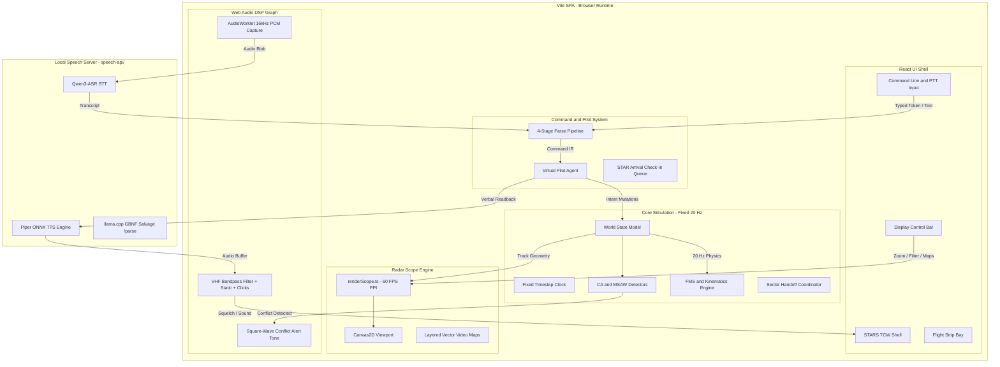

# ATC-SIM architecture

Contracts: [`phases/_shared/`](../phases/_shared/architecture.md). This file is the v1 freeze table plus the live runtime shape.

## v1 freeze

| Topic | Frozen value |
| --- | --- |
| Claim | Simulator (not operational ATC equipment). |
| Runtime | In-browser Vite SPA. No server-authoritative tick. |
| Demo Facility | KDEM (fictional Demo Field). Mag var 0°. Field elev 0 ft. Runway 27. ILS id `ILS27`. ARP 0°N, 0°E. |
| Coordinates | Local ENU NM; T00-04 documents formulas. |
| Command IR | Radio-only; types match [`phases/_shared/command-ir.md`](../phases/_shared/command-ir.md). |
| SpeechPort | Adapter. Quality path: local [`speech-api`](../speech-api/README.md). |
| Scope vs radio | Scope commands never produce a Readback. |
| v1 traffic | Single-player simulated aircraft. No VATSIM/MSFS live traffic. |

## Packages

Single Vite app. Folders under `src/`, not a monorepo.

| Folder | Owns |
| --- | --- |
| `src/core` | Sim clock, aircraft, kinematics, Command IR types |
| `src/parse` | String → `Command` (one stage list; Path C fetch injected) |
| `src/pilot` | Validation, readback templates, intent apply |
| `src/scope` | Canvas PPI, maps, datablocks, scope keys |
| `src/speech` | SpeechPort impls, capture, radio graph |
| `speech-api/` | Local HTTP STT/TTS and Path C `/parse` |
| `src/scenario` | Airport, spawn, maps JSON — see [`src/scenario/README.md`](../src/scenario/README.md) |
| `src/ui` | Shell, command line, strips, settings |

## Runtime

- **Language:** TypeScript, strict.
- **App:** Vite + one HTML entry.
- **Tests:** Vitest. Core/parse/pilot must be DOM-free.
- **Tick:** `requestAnimationFrame` drives render; fixed timestep `dt = 1/20 s` × simRate for physics (accumulator). Physics in a pure function `stepWorld(world, dt)` so tests can run without rAF.
- **Display:** Canvas2D PPI target 60 FPS.
- **State:** Single `World` object. UI subscribes via a small store or React state lifted from `World`.

## Data flow



1. **Deterministic 20 Hz simulation**: Physics clock is accumulator-based and decoupled from rendering. Core logic is pure TypeScript with no DOM dependencies.
2. **60 FPS Canvas2D scope**: PPI paints tracks, history, leaders, datablocks, J-rings, and vector maps.
3. **React TCW shell**: DCB, strips, command line, SSA, menus.

Speech setup: [`speech-api/README.md`](../speech-api/README.md).

## Parse pipeline

Normative stage list: [`phases/_shared/parse-pipeline.md`](../phases/_shared/parse-pipeline.md).

```
User Input (Text or Spoken Audio)
  │
  ├──► [Stage 0: Normalization] (Telephony expansion, number word translation, whitespace cleanup)
  │
  ├──► [Stage 1: Typed Shorthand] (Fast STARS token parser: H240, C50, S210, APP ILS27)
  │      └─► Hit? ──► Return Command IR (parseStage: "typed")
  │
  ├──► [Stage 2: Path A - Spoken Grammar] (Deterministic FAA JO 7110.65 spoken English grammar)
  │      └─► Hit? ──► Return Command IR (parseStage: "spoken_a")
  │
  ├──► [Stage 3: Path B - Fuzzy Rewrite] (Spoken-to-typed phonetic and alias salvage)
  │      └─► Hit? ──► Return Command IR (parseStage: "spoken_b")
  │
  └──► [Stage 4: Path C - Local LLM Salvage] (GBNF grammar-constrained llama.cpp /parse)
         └─► Hit? ──► Validate JSON against Command IR schema ──► Return (parseStage: "llm_c")
```

Parsed instructions resolve to Command IR types in [`phases/_shared/command-ir.md`](../phases/_shared/command-ir.md).

## Coordinate system

Local East-North-Up (ENU) tangent plane in nautical miles (`NmEastNorth`: `xNm` East, `yNm` North) centered at the airport reference point (ARP). Headings `[0, 360)`: `000°` = North (+y world), `090°` = East (+x world). North-up PPI maps +y (world North) to -y (canvas up).

Formulas: [`COORDINATE-SYSTEM.md`](COORDINATE-SYSTEM.md).

## Related

- Scenario / catalog layout: [`src/scenario/README.md`](../src/scenario/README.md)
- CIFP pack CLI: [`tools/cifp-import/README.md`](../tools/cifp-import/README.md)
- CRC video-map pack CLI: [`tools/crc-videomap-import/README.md`](../tools/crc-videomap-import/README.md)
- Build order / tickets: [`phases/README.md`](../phases/README.md)
